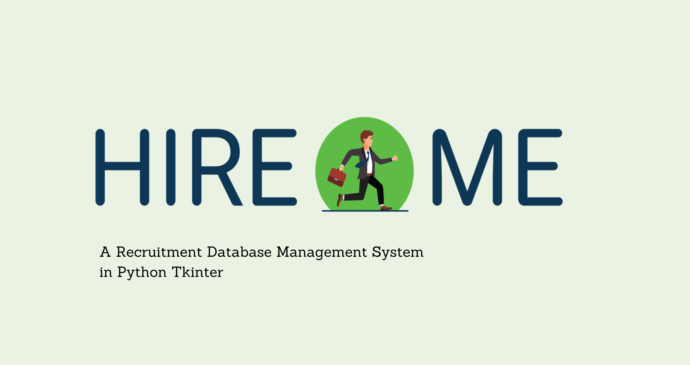

  

# # Hire-ME



###  DBMS Mini-project: Recruitment Management System.💫✨


# Features
- ***Python + MYSQL using mysql.connector library***
- ***Recruiter and Client Panel***
- ***Beautiful UI using tkinter***


## Setup

##### Clone the repository

```bash
git clone https://github.com/karan0805/Hire-Me.git
```

##### Move to the desired folder

```bash
cd Hire-ME
```

##### Make sure MYSQL is running on your System . Now move to `creds.py` inside modules folder and replace the value of `user_pwd`
```
 user_pwd = "your mysql password"
```
##### Now we're almost done so to create the required schema in your machine simply run 
```bash
python db_init.py
```

##### After setting up the schema, to run simply write
```bash
python main.py
```
---


[](https://github.com/karan0805/Hire-Me) 
[](https://github.com/karan0805/Hire-Me)

### If you encounter any difficulty running it, feel free to contact on my email :smile:

### If you liked our work do give us a star :star::star::star: It Encourages us to do more :wink: :dizzy:
